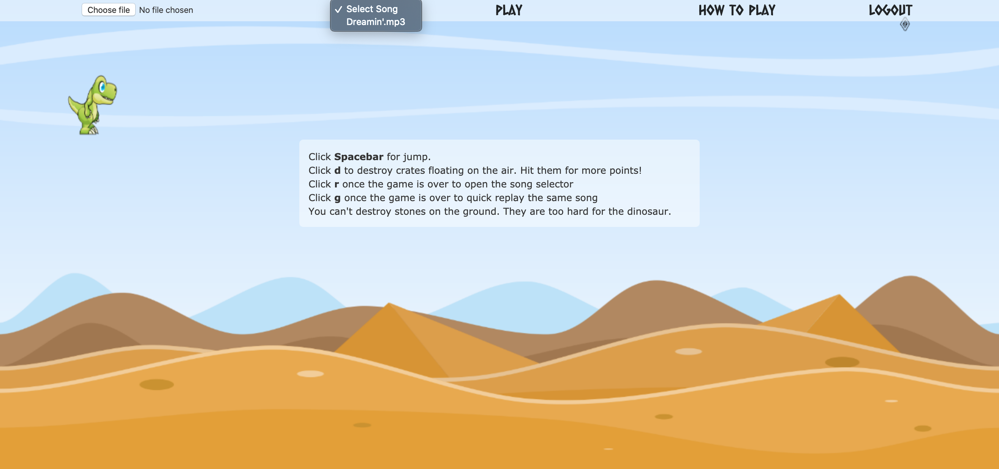
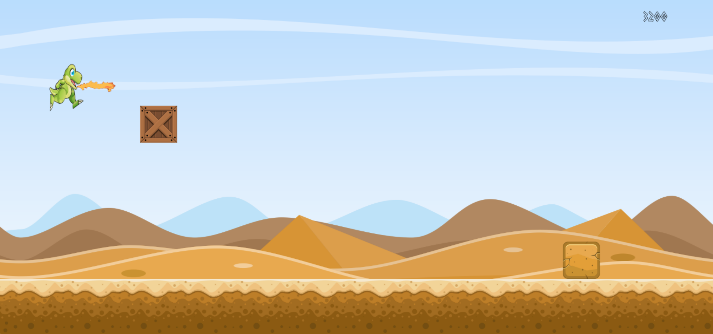
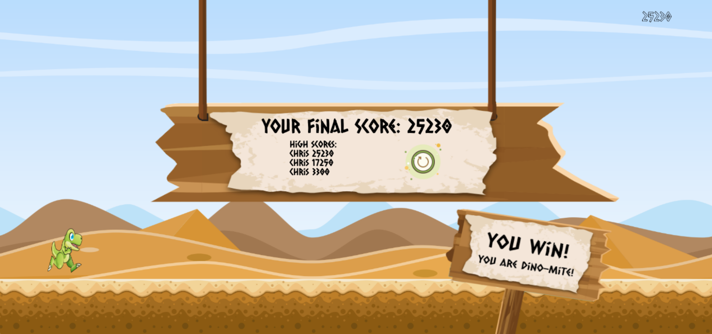
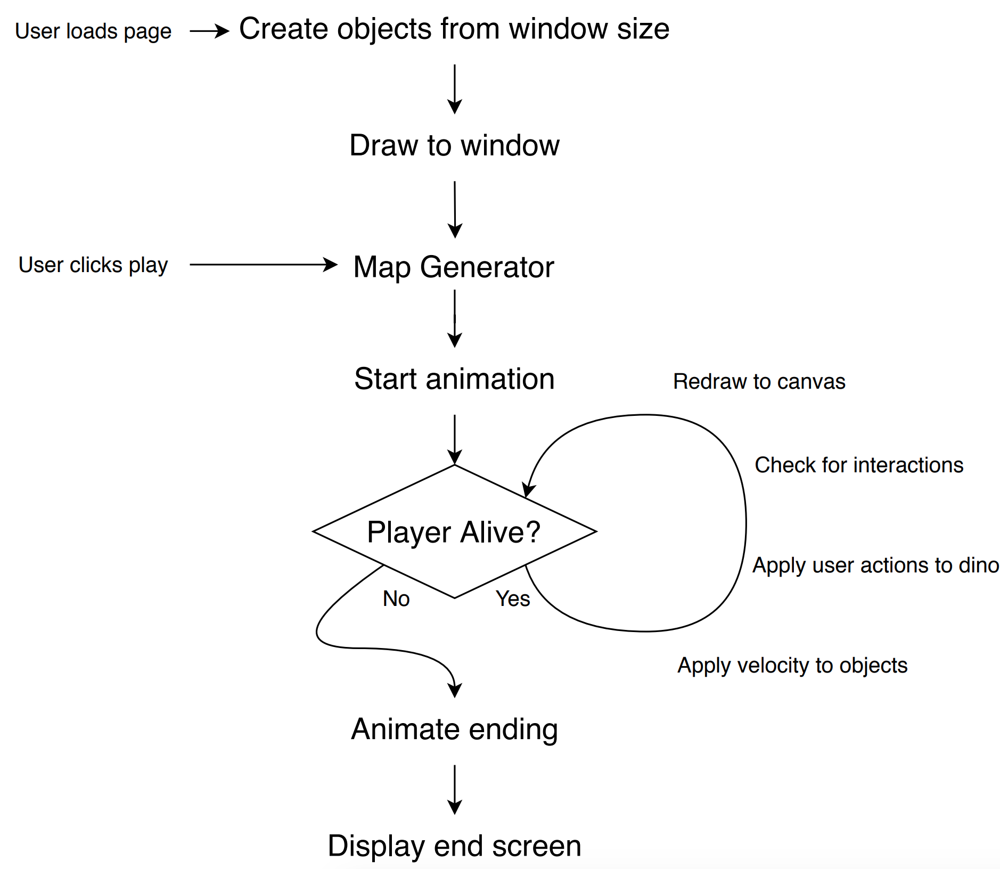
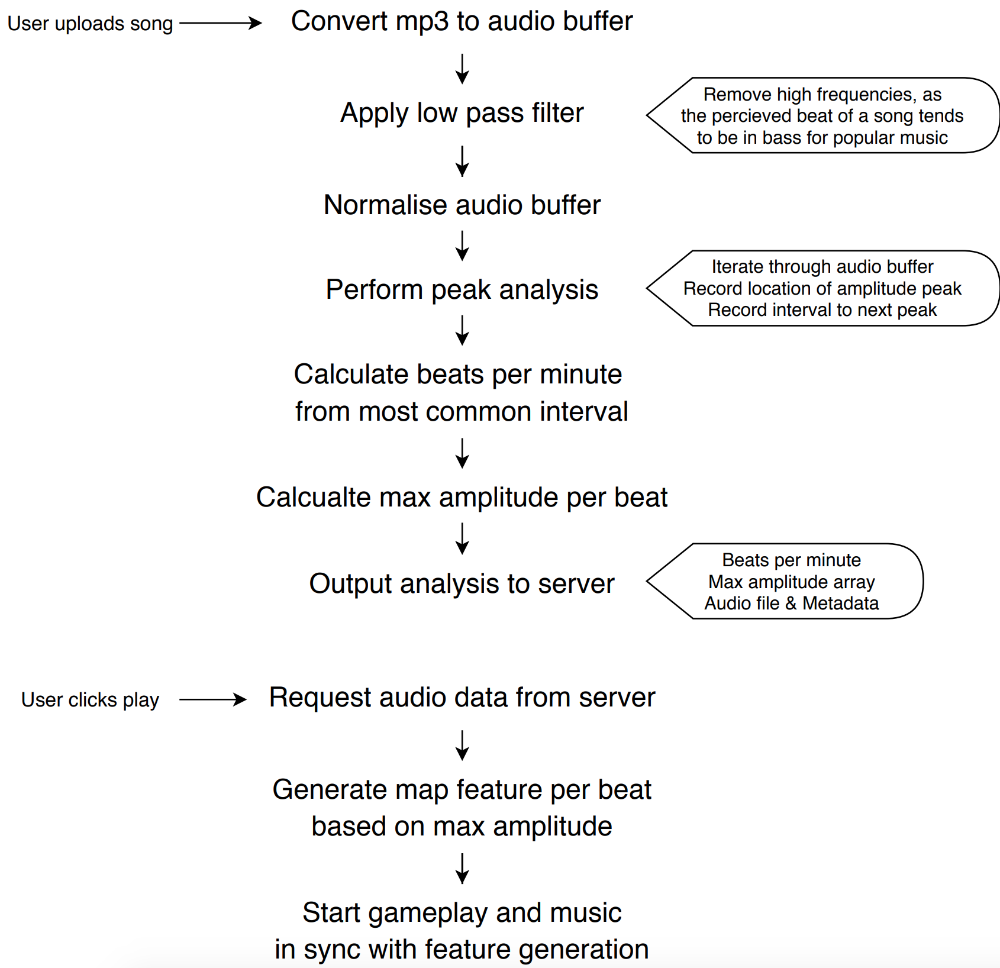

#### Technodactyl Studios presents their debut game:
# Dinorun

```
                  ,                                                            .') \|/________________
               ,  ;:._.-`''.                                            ...-~ .' .'               . - ~
             ;.;'.;`      _ `.                                     _._-_'  o   \ /         . - ~
              ',;`       ( \ ,`-.                                   _._-_~__   /|       .'
           `:.`,         (_/ ;\  `-.                                        | ( /       |
            ';:              / `.   `-._                                    (    ~-.    |
          `;.;'              `-,/ .     `-.                                 /\       `. |
          ';;'              _    `^`       `.                      _\|. - ~    ~ .     ~-.  .._
         ';;            ,'-' `--._          ;                     .'                ~\ |~-.~.'~
':      `;;        ,;     `.    ':`,,.__,,_ /                   .'            . - ~ ~ \`,  ~
 `;`:;`;:`       ,;  '.    ;,      ';';':';;`                  /       . - ~          //
              .,; '    '-._ `':.;                              |   .-~                ""
            .:; `          '._ `';;,                           |.'
          ;:` `    :'`'       ',__.)                          
        `;:;:.,...;'`'                                      
      ';. '`'::'`''  .'`'                                   
    ,'   `';;:,..::;`'`'                                           
, .;`      `'::''`                                                
,`;`.                                             
```


## Overview

Dinorun is a side scrolling platform game where the levels are procedurally generated based on audio files uplaoded by the user. 

It's built as a single page application, with a responsive design. It is played using the keyboard and also has touch screen controls so can be played on phone or tablet devices.

The levels and scores are stored in a PSQL database, with the top three scores for the current level are displayed on the end screen.


## Note

This project was originally a Makers Academy final project, which has since been exported and modifed by myself. To see the original repository, please click [here](https://github.com/cpcwood/technodactyl-studios-dinorun).

-----------
## How to Install

#### Prerequisites

The application has been developed using Ruby v2.6.5, Ruby on Rails v6.0.2.2 and PostgreSQL. Therefore to install the application please ensure you have the following installed:
- ruby 2.6.5 (can be installed from the terminal using homebrew ```brew install ruby``` and version checked using rvm ```rvm use 2.6.5```)
- bundler (can be installed from the terminal through ruby gems ```gem install bundler```)
- PostgreSQL (can be installed from the terminal using homebrew ```brew install postgres```)

Once the above has been installed, clone or download the git repository, move to the program root directory, then run the following in the command line to install the program:

```bash
bundle install
yarn install
```

#### Credientials and Database

Since the application requires persistent data, such as users and mp3 files, a PSQL database is used in conjunction with ApplicationRecord. To set the database up, first ensure you have PSQL installed and running as a service. Then create the revelant rails credentials for each environment as shown below. The application is set up to have three different environments, if you are developing the application further, please set up credientals for all three, however if you are only installing production, skip 'development' credientals and perform all commands with the environment variable ```RAILS_ENV=production```.

Development:
- Fill in the template for the global credientals, which be found in ```config/credentials/credentials.yml.enc.template```
- Open the rails credentials in your editor of choice ```EDITOR=vim rails credentials:edit``` (if this if your first time opening the credentials, a new rails master key ```config/master.key``` to encrypt the credentials will be generated, do not check this into your version control)
- Add the filled template to the credentials list, then save and exit

Production:
- Fill in the template for the production credientals, which be found in ```config/credentials/production.yml.enc.template```
- Open the rails credentials in your editor of choice ```EDITOR=vim rails credentials:edit -e production``` (if this if your first time opening the credentials, a new rails production key ```config/credentials/production.key``` to encrypt the credentials will be generated, do not check this into your version control)
- Add the filled template to the credentials list, then save and exit


To setup the development and test database tables with the correct schema run the following in the command line:
```bash
rails db:create
rails db:migrate
```

#### Server Configuration

The application uses Ruby on Rails default application server: Puma. The configuration for the puma server are in ```config/puma.rb```. The server is currently setup to listen for packets on the local unix socket ```shared/sockets/puma.sock```, to change the server to listen on a localhost port, comment the unix socket line and uncomment the local server port line to host on `http://localhost:3000/`.

#### How to run

To start the server run ```rails server``` in the relevant RAILS_ENV environment.

-----------
## Running Tests

Testing Suites: 
- Backend - Rspec, Capybara 
- Frontend - Jasmine

To run the backend tests run `rspec` in the command line
To run the frontend tests run `rails s` in the command line, then navigate to `http://localhost:3000/jasmine` (ensure the server is set to run on localhost, see [above](####Server-Configuration))

-----------
## Gameplay

#### Song Selection


#### Gameplay


#### Win Screen


-----------
## Game Engine Flow

Game engine developed in pure Javascript without frameworks.



-----------
## Audio Analysis Flow

Audio analysis using Javascript Web Audio API peak analysis.

